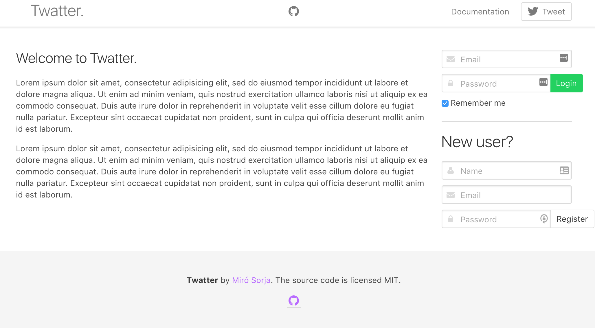
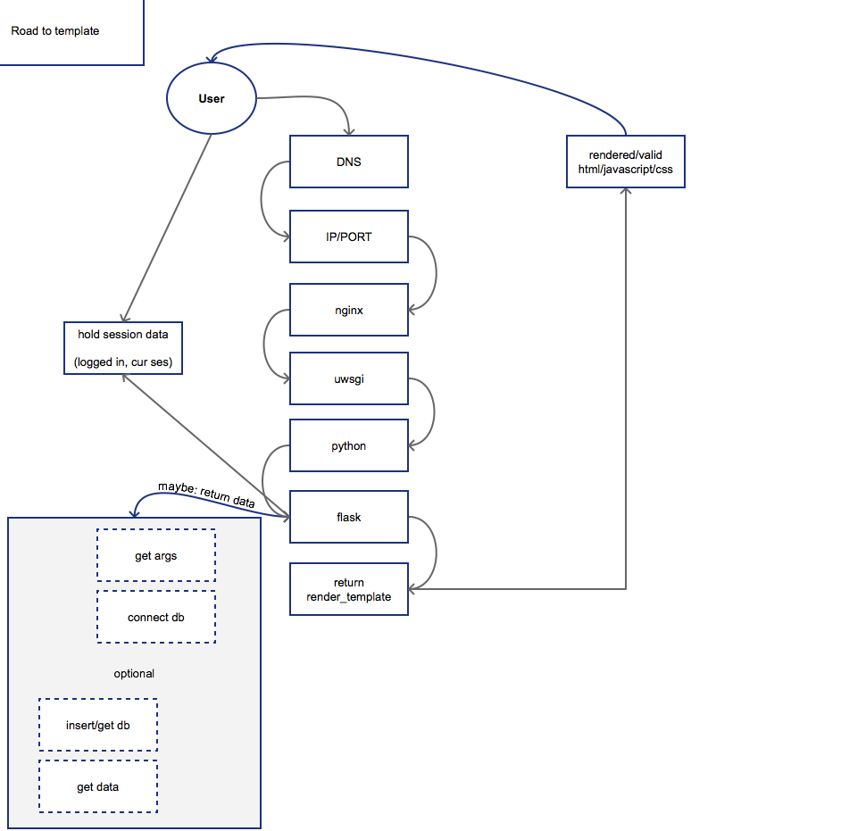

Twatter
------
**See it live**: http://www.valit.us/   
**user** 123
**password** 123

School project for course [582203/2016/s/a/1](https://www.cs.helsinki.fi/courses/582203/2016/s/a/1)  

Cheap knock off of Twitter which is probably created around whining (valitus)  

---

[Documentation](doc/Documentation.pdf)  

---

##To know
1. All 'views' are in [templates](templates/) and are made using jinja
2. [templates](config.py) is required to be set up with your DB info and secret key (see example)
3. [bower](https://bower.io/) is used for frontend dependencies

---
##Running locally
*You need postgres SQL server running and update connections*  
*It's better to use virtualenvwrapper instead of globally installing packages!*  
1. pip install -r requirements.txt  
2. npm install -g bower  
3. bower install  
4. update config.py  
5. chmod +x dev.sh (optional, if missing)  
6. ./dev  

---
Road to GET

